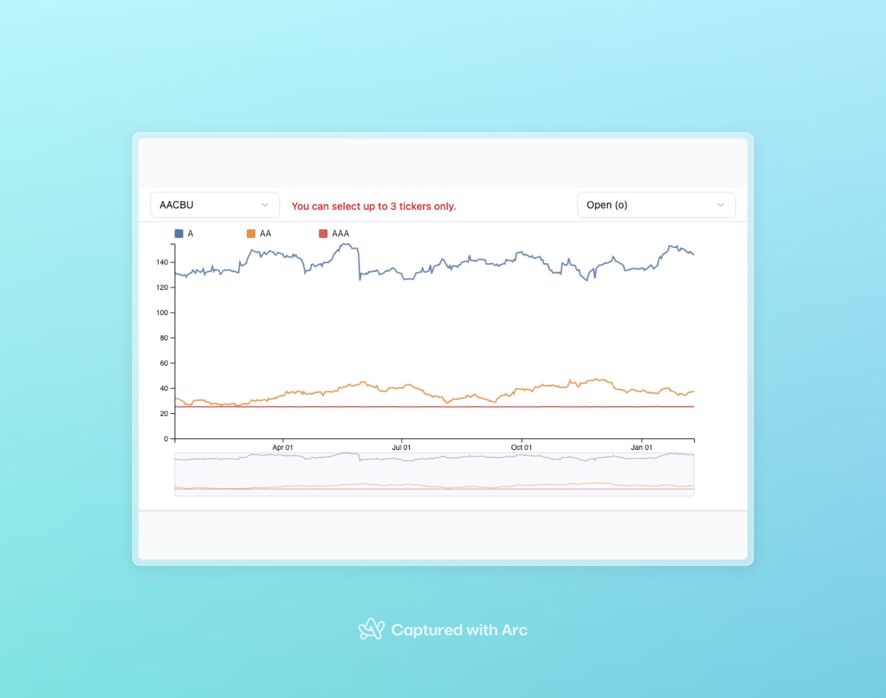

# Interactive Stock Chart with D3 + React

This project demonstrates an **interactive multi-line stock chart** built with **React, TypeScript, D3.js, and TailwindCSS**.

### Business Context

To facilitate discretionary management, fund managers are often interested in not only looking at
prices of stocks today but what they have been previously to gain further insight into companies.

### User Story

As a fund manager

- I want a single page application where I can select stocks on the US Stock Exchange and a date range (from and to date) so that I can chart a time series of prices for the selected stocks and date range.

---

## Features

- **Multi-line chart**  
  Display multiple stock tickers simultaneously, each with its own color from a categorical D3 color scale.

- **OHLC selection (Open, High, Low, Close)**  
  Toolbar includes a `Select` dropdown to choose which price type (`o`, `h`, `l`, `c`) is visualized.  
  Default is `"o"` (open price).

- **Ticker management with selection limit**

  - Add up to **3 tickers** via the dropdown.
  - Selections are displayed as badges in the toolbar.
  - Error message shown if more than 3 are selected.

- **Interactive zoom & filter**

  - Integrated D3 `brush` component allows users to zoom in on a custom date range.
  - Double-click to reset back to the full timeline.

- **Responsive scales and axes**

  - X-axis uses `d3.scaleTime` with formatted date ticks.
  - Y-axis adapts to the selected range dynamically.
  - Brush overview area shows a condensed timeline with a subtle background.

- **Modern UI**
  - Built with [Shadcn/UI](https://ui.shadcn.com/) for accessible dropdowns.
  - TailwindCSS styling for a clean, modern look.
  - Toolbar with dropdowns and badges.

---

## Tech Stack

- **React + TypeScript**
- **D3.js** for charting (scales, axes, line generator, brush)
- **TailwindCSS** for styling
- **Shadcn/UI** for dropdown components

---

## Project Structure

```
src/
 ├─ components/
 │   ├─ ui/
 │      └─ select.tsx      # Select component from Shadcn
 │   ├─ LineChart.tsx      # Main multi-line stock chart
 │   └─ Toolbar.tsx        # Toolbar with ticker + price type selectors
 ├─ types/
     └─ index.ts           # StocksAggregates interface (OHLCV etc.)
```

---

## Getting Started

1. Clone this repository

   ```bash
    <!--git clone & cd into directory -->
   ```

2. Install dependencies

   ```bash
   npm install
   ```

3. Run the dev server

   ```bash
   npm run dev
   ```

4. Open in browser  
   Navigate to `http://localhost:4000/`

---

## Next Steps

- [ ] **Adding date filter**  
       Missed adding a date filter on the data fetch itself. Hope the brush component makes up for it.

- [ ] **Chart Legend improvements and click to remove**  
       Allow users to click on each legend item to remove a ticker selection.

- [ ] **Hover tooltip**  
       Display date, ticker, and OHLC value at the hovered point on the chart.

- [ ] **Legends sync**  
       Highlight line + badge when hovering to improve readability.

- [ ] **Real-time data support**  
       Stream live stock data (via WebSocket or API) to update chart in real time.

- [ ] **Export options**  
       Allow exporting the current view to PNG/SVG for reporting.

---

## Images / video



---

## Disclaimer

This project is a **toy/demo application** created for learning and showcasing frontend + D3 integration.  
Because of timing, it does **not follow all production best practices** (e.g., full react scalable architecture, performance optimizations, accessibility, testing, error handling).
There are also some bugs and minor UI inconsistencies which remain, but they are mostly trivial issues that could be resolved with a bit more time.
